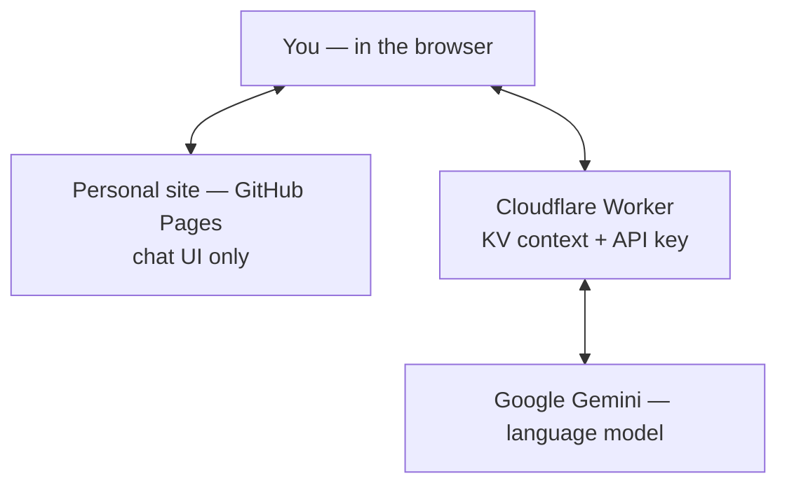

# How the site’s AI chat works

This page is a **plain-language overview** for anyone curious about the design—not a setup guide or security audit.

## What you see

The site has a chat area (“AI mode”) where you can ask about my background. Answers are meant to match material I provide for the assistant—not random guesses from the open web.

## How it works, in short

1. **Facts and instructions** live in **Cloudflare Workers KV** (not the public static site). The **Worker** reads that text and sends it to Gemini as `system_instruction` on every request.
2. **Your question** (and prior turns) are sent from the browser as **`contents` only**—no client-controlled system prompt.
3. A **thin relay** on Cloudflare forwards the composed request to **Google Gemini** so the API key never appears in the webpage.

## Tech stack

| Layer | What it is |
|-------|------------|
| **Site** | Static HTML/CSS, hosted on **GitHub Pages** |
| **Context** | Markdown stored in **Workers KV**, injected by the Worker |
| **Model** | **Google Gemini** (hosted API) |
| **Bridge** | **Cloudflare Worker** — CORS proxy, key holder, prompt assembly |

No database, no separate app server: the page you load is the UI; the Worker is the small server component.

## Architecture at a glance

The public file [`fred-context.md`](fred-context.md) on the site is only a short notice; the assistant does not rely on it for answers.
